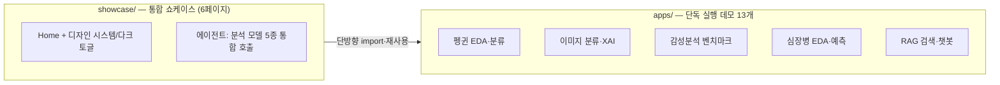

# 📊 데이터를 읽고, 모델로 증명하고, 왜 그런지 설명까지 합니다


EDA로 데이터를 먼저 심문하고, 성능은 베이스라인 대비와 변동성(±)으로 보고하며, 보정되지 않은 확률에는 그 사실을 화면에 명시합니다 — **숫자의 한계까지 전달하는 것을 분석의 일부로 취급하는** 라이브 데모 포트폴리오입니다.
이미지 분류기가 "어디를 보고" 판단했는지 occlusion 히트맵으로 보여주고, 감성분석 모델이 학습 도메인 밖에서 왜 "자신 있게" 틀리는지 벤치마크로 정량화합니다.

| 📊 데이터 분석 · EDA | 🧠 딥러닝 · XAI | 🔗 LLM 응용 · 서빙 |
|---|---|---|
| 분포·상관 심문 → 모델링, **CV 변동성**·**permutation importance**·미보정 확률 고지 | **occlusion 히트맵**, leave-one-out 단어 기여도, **도메인 이탈 벤치마크** | 3-provider RAG(임베딩·LLM)·자동 폴백, torch **CPU 휠 서빙**, tool-calling 에이전트 |

## 🔗 라이브 데모

| 앱 | 이걸 해보세요 | 바로가기 |
|---|---|---|
| 🫀 심장병 위험 예측 | 상관 상위 피처를 EDA로 먼저 보고, 그 피처의 슬라이더를 움직여 예측 확률이 같은 방향으로 반응하는지 확인 | [열기](https://app2-rnbsncriohhdasyzfgv8ym.streamlit.app/) |
| 🐧 펭귄 분류 | EDA에서 3종이 겹치는 구간을 확인한 뒤, 그 경계값을 입력해 분류기 확신도가 실제로 흔들리는지 관찰 | [열기](https://app2-jsojkw9cctyh9yahqsyz7n.streamlit.app/) |
| 🖼️ 이미지 분류 + XAI | 사진을 올리고 occlusion 히트맵으로 "어느 영역을 가리면 확신이 무너지는지" 직접 검증 | [열기](https://v2kgfh2nsnmn9ytyrmo8xb.streamlit.app/) |
| 📚 PDF RAG 챗봇 | 문서를 올려 질문하고, 답변의 출처 청크가 실제 그 문단에서 왔는지 대조 | [열기](https://app2-cqc6rxtgfvseuz4axitzk4.streamlit.app/) |
| 🎯 ML 쇼케이스 (6페이지 통합) | 위 전부 + 에이전트에게 "62세 심장병 위험 알려줘"라고 자연어로 지휘 | [열기](https://app2-i3qsojjspfj3bxpbwc7dmt.streamlit.app/) |

> ⏳ 무료 티어 특성상 잠들어 있던 앱은 첫 로딩에 30초쯤 걸립니다 — 링크를 새 탭으로 미리 열어두고 아래를 읽으시면 됩니다.

## 📏 숫자를 다루는 방식

이 저장소의 모든 앱이 지키는 원칙입니다 — 각 항목은 실제 앱 화면·코드에 그대로 있습니다.

1. **확률을 넘겨 말하지 않기** — 모든 예측 확률에 "보정(calibration)되지 않은 값"임을 화면에서 직접 고지합니다.
2. **정확도는 한 숫자가 아니라 범위** — 단일 split 점추정 대신 5-fold 층화 교차검증 **평균 ± 표준편차**로 "분할에 따라 얼마나 출렁이는지"까지 보여줍니다.
3. **중요도 ≠ 인과** — 피처 중요도는 held-out **permutation importance**로 계산하고, "예측 기여이지 인과가 아니다"를 캡션으로 명시합니다.
4. **베이스라인 없는 성능 주장 금지** — 감성분석은 다수결 베이스라인 대비 개선폭으로, 이미지 확률은 무작위 참고치(1/1000) 대비 배수로 보고합니다.
5. **EDA가 모델보다 먼저** — 분포·결측·상관 구조를 심문한 뒤에 예측합니다. 임의 CSV를 받아 이 과정을 자동화하는 `eda_template.py`(한국어 Excel cp949 지원)도 포함돼 있습니다.

## 🔬 하이라이트

### 🫀 EDA → 예측이 한 화면에서 — 심장병 위험 예측

UCI Heart Disease 1,025명(CC BY 4.0, 데이터 동봉). 연령×발병 분포와 타깃 상관 상위 피처를 먼저 훑고, 13개 지표를 조정하며 위험 확률이 상관 구조와 같은 방향으로 반응하는지 검증합니다. *교육용 데모 — 의료 진단이 아닙니다.*

### 🖼️ "왜 그렇게 판단했나"를 눈으로 — occlusion XAI

이미지를 8×8 격자로 가려보며(64장 배치 1회 추론) 어느 영역이 사라지면 MobileNetV2의 확신이 무너지는지 히트맵으로 확인합니다. 같은 perturbation 원리를 텍스트에도 적용해, 감성분석에서는 **단어 하나를 빼면 판정이 얼마나 흔들리는지**(leave-one-out) 관찰합니다.

### 💬 모델이 "자신 있게 틀리는" 순간 — 도메인 이탈 벤치마크

KoELECTRA 감성분류기는 영화 리뷰(NSMC)로만 fine-tuning됐습니다. 학습 도메인 밖(쇼핑몰 리뷰) 문장을 섞은 20문장을 일괄 채점해, 다수결 베이스라인 대비 개선폭과 **고확신(90%+) 오분류 비율**로 "배운 도메인 밖에서는 자신 있게 틀린다"는 현상을 정량화합니다.

### 📚 업로드부터 생성 답변까지 — 3-provider RAG

문서 업로드 → 청킹 → 임베딩 검색(local Ollama / OpenRouter / OpenAI, 무키 시 TF-IDF 폴백) → 검색 근거로 LLM 답변 생성 → 출처 청크 표시. provider를 자동 감지하고, 호출이 실패하면(무료 모델 혼잡 등) 다른 provider로 이어 답변이 끊기지 않습니다.

### 🤖 분석을 서비스로 잇는 마감재 — tool-calling 에이전트

위 분석 모델들을 하나의 자연어 인터페이스로 통합했습니다. 어떤 도구를 왜 골랐는지 **호출 trace를 그대로 노출**하고, API 키가 없으면 데모 모드(키워드 라우팅)가 같은 도구를 호출합니다.

<details>
<summary>에이전트에 등록된 도구 5개</summary>

| 도구 | 뒤에서 도는 모델 |
|---|---|
| `classify_penguin` | RandomForest (팔머펭귄 3종) |
| `classify_image` | MobileNetV2 (ImageNet 1000종) |
| `analyze_sentiment` | KoELECTRA-small (한국어 긍/부정) |
| `predict_heart` | RandomForest (UCI 심장병 — 미입력 지표는 중앙값 자동 보완) |
| `search_docs` | TF-IDF/임베딩 검색 (RAG 페이지에서 올린 내 문서) |

</details>

## 🏗️ 구조 — 이중 레이어



`showcase`는 `apps`의 모델을 **재구현 없이 import**해 도구로 노출합니다 — 의존은 한 방향뿐이라 각 앱은 언제나 단독으로도 실행됩니다.

## 🚀 직접 실행하기

```bash
pip install -r requirements.txt
python -m streamlit run showcase/Home.py        # 통합 쇼케이스
python -m streamlit run apps/heart_disease.py   # 개별 앱
```

<details>
<summary>Windows · API 키 · 로컬 LLM(Ollama) 설정</summary>

- Windows는 `py -3.11 -m streamlit run ...`. 환경 점검: `수업전_환경체크.md` / 모델 사전 다운로드: `python prerequisite.py`
- **API 키(선택)** — LLM·임베딩 기능용. 루트에 `.env`를 만들면 자동 로드됩니다(코드에 키를 적지 마세요):

```
OPENROUTER_API_KEY=발급받은_키
OPENAI_API_KEY=발급받은_키
```

- 로컬 무료 경로: [Ollama](https://ollama.com) 설치 후 `ollama pull hermes3:8b`, `ollama pull nomic-embed-text`
- 키가 없어도 모든 앱이 데모(검색) 모드로 동작합니다.

</details>

<details>
<summary>☁️ Streamlit Cloud에 배포하기</summary>

1. [share.streamlit.io](https://share.streamlit.io) → **Create app** → 이 저장소 / `main`
2. **Main file path**: `showcase/Home.py` (또는 `apps/` 개별 앱)
3. LLM 기능은 **Settings → Secrets**에 위 키를 TOML로 입력

루트 `requirements.txt`는 torch를 **CPU 전용 휠 인덱스**로 받아 무료 티어 용량 안에서 서빙하고, `packages.txt`가 한글 폰트(fonts-nanum)를 설치합니다. 상세: [`deploy/배포_튜토리얼.md`](deploy/배포_튜토리얼.md)

</details>

<details>
<summary>📂 전체 앱 목록</summary>

| 앱 | 내용 | 키 필요 |
|---|---|---|
| `apps/m1_hello.py` | Streamlit 기본 문법 데모 | ✗ |
| `apps/m3_penguins.py` | 펭귄 분류 EDA + ML (가장 가벼움) | ✗ |
| `apps/heart_disease.py` | 심장병 위험 예측 대시보드 (`data/heart.csv` 동봉) | ✗ |
| `apps/eda_template.py` | CSV 업로드 EDA 템플릿 (cp949 지원) | ✗ |
| `apps/m4_image.py` | 이미지 분류 + occlusion 히트맵(XAI) | ✗ |
| `apps/m4_sentiment.py` | 한국어 감성분석 도메인 이탈 벤치마크 | ✗ |
| `apps/m4b_weather_api.py` | 공개 날씨 API 대시보드 | ✗ |
| `apps/m5_chatbot.py` · `m5b_agent_loop.py`(+stream) | 챗 UI · tool-calling 루프 | 없으면 데모 모드 |
| `apps/rag_lite.py` · `rag_chatbot.py` | 무키 RAG · PDF RAG 챗봇 | 없으면 검색 모드 |
| `showcase/` | 위 전부를 묶은 6페이지 쇼케이스 | 없으면 데모 모드 |

함께 운영 중인 다른 데모: [공공 Web API 실습](https://260406webapipractice.streamlit.app/) · [MNIST CNN 숫자 인식기](https://mnist-app-aihuman.streamlit.app/) (별도 저장소)

</details>

---

이스트소프트 KDT AI Human 과정 강사·PM 출신이 직접 설계·구현했습니다.
