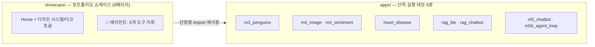

# 🎈 Streamlit ML 데모 포트폴리오


**머신러닝 데모 앱 9종과, 그 모델들을 도구(tool)로 지휘하는 tool-calling 에이전트 쇼케이스**를 담은 저장소입니다.
분류·시각화·XAI·RAG·에이전트까지 — 전부 이 저장소 그대로 Streamlit Cloud에 배포됩니다.

## 🔗 라이브 데모

| 앱 | 설명 | 바로가기 |
|---|---|---|
| 🎯 **ML 쇼케이스** (추천) | 6페이지 통합 — 아래 모델 전부 + 에이전트 | [열기](https://app2-i3qsojjspfj3bxpbwc7dmt.streamlit.app/) |
| 🐧 펭귄 분류 | 인터랙티브 EDA + RandomForest | [열기](https://app2-jsojkw9cctyh9yahqsyz7n.streamlit.app/) |
| 🫀 심장병 위험 예측 | EDA + 13개 지표 위험 확률 | [열기](https://app2-rnbsncriohhdasyzfgv8ym.streamlit.app/) |
| 🖼️ 이미지 분류 | MobileNetV2 + occlusion 히트맵(XAI) | [열기](https://v2kgfh2nsnmn9ytyrmo8xb.streamlit.app/) |
| 📚 PDF RAG 챗봇 | 내 문서 업로드 → 질문 → LLM 답변 | [열기](https://app2-cqc6rxtgfvseuz4axitzk4.streamlit.app/) |

> 쇼케이스 하나로 전체를 볼 수 있습니다 — 개별 앱은 같은 코드의 단독 실행 버전입니다.
> 함께 운영 중인 다른 데모: [공공 Web API 실습](https://260406webapipractice.streamlit.app/) · [MNIST CNN 숫자 인식기](https://mnist-app-aihuman.streamlit.app/) (별도 저장소)

## ✨ 하이라이트

### 🤖 tool-calling 에이전트 — 모델 5개를 자연어로 지휘

"62세 심장병 위험 알려줘", "문서에서 주차 규정 찾아줘" 같은 문장을 넣으면 에이전트가 **어떤 도구를 왜 골랐는지 trace를 그대로 노출**하며 실제 모델을 호출합니다.

| 도구 | 뒤에서 도는 모델 |
|---|---|
| `classify_penguin` | RandomForest (팔머펭귄 3종) |
| `classify_image` | MobileNetV2 (ImageNet 1000종) |
| `analyze_sentiment` | KoELECTRA-small (한국어 긍/부정) |
| `predict_heart` | RandomForest (UCI 심장병, 미입력 지표는 중앙값 자동 보완) |
| `search_docs` | TF-IDF/임베딩 검색 (RAG 페이지에서 올린 내 문서) |

API 키가 없어도 **데모 모드**(키워드 라우팅)로 같은 도구를 실제 호출하고, 키를 연결하면 LLM이 도구를 스스로 선택합니다.

### 📚 PDF RAG 챗봇 — 업로드부터 생성 답변까지 한 파이프라인

문서 업로드 → 청킹 → **임베딩 검색**(local Ollama / OpenRouter / OpenAI 3-provider) → 검색 근거로 **LLM이 답변 생성** → 출처 청크 표시.
provider를 자동 감지하고, 호출이 실패하면(무료 모델 혼잡 등) 다른 provider로 폴백해 답변이 끊기지 않습니다.

### 🫀 심장병 위험 예측 — EDA와 예측을 한 화면에서

UCI Heart Disease 1,025명 데이터 동봉(CC BY 4.0). 연령×타깃 분포, 상관 상위 피처 EDA와 13개 지표 입력→위험 확률 예측. *교육용 데모 — 의료 진단이 아닙니다.*

## 🏗️ 구조 — 이중 레이어



`showcase`는 `apps`의 모델을 **재구현 없이 import**해 도구로 노출합니다 — 의존은 한 방향뿐이라 각 앱은 언제나 단독으로도 실행됩니다.

## 🚀 직접 실행하기

```bash
pip install -r requirements.txt
python -m streamlit run showcase/Home.py        # 쇼케이스 전체
python -m streamlit run apps/m3_penguins.py     # 개별 앱
```

> Windows는 `py -3.11 -m streamlit run ...`. 환경 점검: `수업전_환경체크.md` / 모델 사전 다운로드: `python prerequisite.py`

**API 키(선택)** — LLM·임베딩 기능용. 루트에 `.env`를 만들면 자동 로드됩니다:

```
OPENROUTER_API_KEY=발급받은_키
OPENAI_API_KEY=발급받은_키
```

키가 없어도 모든 앱이 데모(검색) 모드로 동작하며, 로컬 무료 경로는 [Ollama](https://ollama.com)(`hermes3:8b`, `nomic-embed-text`)입니다.

## ☁️ Streamlit Cloud에 배포하기

1. [share.streamlit.io](https://share.streamlit.io) → **Create app** → 이 저장소 / `main`
2. **Main file path**: `showcase/Home.py` (또는 `apps/` 개별 앱)
3. LLM 기능은 **Settings → Secrets**에 위 키를 TOML로 입력

루트 `requirements.txt`(torch CPU 휠 인덱스 — 무료 티어 용량 대응)와 `packages.txt`(한글 폰트)가 자동 적용됩니다. 상세 절차·트러블슈팅: [`deploy/배포_튜토리얼.md`](deploy/배포_튜토리얼.md)

## 📂 전체 앱 목록

| 앱 | 내용 | 키 필요 |
|---|---|---|
| `apps/m1_hello.py` | Streamlit 기본 문법 데모 | ✗ |
| `apps/m3_penguins.py` | 펭귄 분류 EDA + ML (가장 가벼움) | ✗ |
| `apps/heart_disease.py` | 심장병 위험 예측 대시보드 | ✗ |
| `apps/eda_template.py` | CSV 업로드 EDA 템플릿 (cp949 지원) | ✗ |
| `apps/m4_image.py` | 이미지 분류 + occlusion 히트맵(XAI) | ✗ |
| `apps/m4_sentiment.py` | 한국어 감성분석 일괄 채점 | ✗ |
| `apps/m4b_weather_api.py` | 공개 날씨 API 대시보드 | ✗ |
| `apps/m5_chatbot.py` · `m5b_agent_loop.py` | 챗 UI · tool-calling 루프 | 없으면 데모 모드 |
| `apps/rag_lite.py` · `rag_chatbot.py` | 무키 RAG · PDF RAG 챗봇 | 없으면 검색 모드 |
| `showcase/` | 위 전부를 묶은 6페이지 쇼케이스 | 없으면 데모 모드 |
